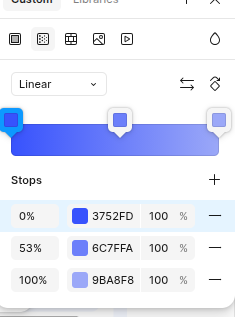
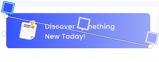
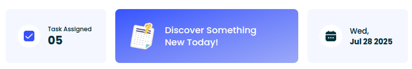
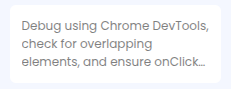

# Project Name:

## Project Description: 

## Live Site Link:

## Project Video:

## What I Learned New while Building This Project:

1. How to customization tailwind CSS and DaisyUI:  
```css
    <!-- Customize Tailwind CSS -->
    <style type="text/tailwindcss">
        @theme {
      --font-poppins: "Poppins", sans-serif;
    }
  </style>

    <!-- Customize DaisyUI colors -->
    <style>
        :root {
            --color-primary: #3752FD;
            --color-primary-content: #00303C;
            --color-secondary: #F4F7FF;
        }
    </style>
```  
2. If i want this liner gradient using tailwind css,  
   



and if i write the tailwind classes like this, then we got opposite gradient, 
```html
       <div
                    class="flex gap-5 items-center bg-gradient-to-tl from-[#3752FD] from-0% via-[#6C7FFA] via-53% to-[#9BA8F8] to-100% p-8 rounded-xl">
                    <div>
                    </div>
                    <p class="text-2xl font-medium text-white">Discover Something<br>New Today!</p>
                </div>
``` 


but you we reverse the full gradient then we got actual accepted gradient,   
```html
                <div
                    class="flex gap-5 items-center bg-gradient-to-tl from-[#9BA8F8] from-0% via-[#6C7FFA] via-53% to-[#3752FD] to-100% p-8 rounded-xl">
                    <div>
                    </div>
                    <p class="text-2xl font-medium text-white">Discover Something<br>New Today!</p>
                </div>
```
  

3. How to use 12 column grid system properly. 

```html
  <section class="grid grid-cols-12">
                <div class="col-span-3 flex gap-5 items-center bg-secondary p-8 rounded-xl">
                    <div class="rounded-full p-4 bg-white">
                    </div>
                    <div>
                        <p class="font-medium">Task Assigned</p>
                        <h1 class="font-bold text-3xl">05</h1>
                    </div>
                </div>

                <div
                    class="col-span-6 mx-6 flex gap-5 items-center bg-gradient-to-tl from-[#9BA8F8] from-0% via-[#6C7FFA] via-53% to-[#3752FD] to-100% p-8 rounded-xl">
                    <div>
                    </div>
                    <p class="text-2xl font-medium text-white">Discover Something<br>New Today!</p>
                </div>

                <div class="col-span-3 flex gap-5 items-center bg-secondary p-8 rounded-xl">
                    <div class="rounded-full p-4 bg-white">
                    </div>
                    <div>
                        <p class="font-medium text-xl">Wed,</p>
                        <h1 class="font-bold text-xl">Jul 28 2025</h1>
                    </div>
                </div>
            </section> 
```
 

4. How to use line clamp in tailwind css:
```html 
<div class=" bg-white p-4 rounded-lg text-black/50">
    <p class="line-clamp-3">Debug
        using Chrome
        DevTools, check for overlapping elements, and ensure onClick works properly
        and ensure onClick works properly</p>
</div>
```


5. When we use the same script file across multiple HTML pages, we must always check if an ID exists on the current page before accessing it. For example, an ID that exists in index.html might not exist in discover-something-new.html. If we try to access it directly, then we will get error, because js won't find the expected id in that page: 
```js
navigate("navigate-to-discover-something-new-page", "pages/discover-something-new.html")
navigate("navigate-to-home-page", "../index.html")
```
```js
function navigate(id, destination) {
    document.getElementById(id).addEventListener("click", () => {
        window.location.href = destination
    })
}
```

To solve this problem, we can use a condition.so, now the function only attaches the event listener if the element exists on that page, preventing errors when using the same script file across different pages.
```js
function navigate(id, destination) {
    const element = document.getEltementById(id);
    if (element) {
        document.getElementById(id).addEventListener("click", () => {
            window.location.href = destination
        })
    }
}
```

6. How to generate random colors:

Using Hexadecimal Format: 
```js
function getRandomHexColor() {
    const hex = Math.floor(Math.random() * 0xffffff).toString(16); 
    return `#${hex.padStart(6, "0")}`; 
}

console.log(getRandomHexColor()); // Example: "#1a2b3c"
```
- Math.floor(Math.random() * 0xffffff) generates a decimal number between 0 and 16777215 (0xffffff is 16777215 in decimal, which is the maximum hex color value).
- .toString(16) converts it to hexadecimal. Example: 255 → "ff"
- Someting you got less then 6 digts hexadecimal vaues so, .padStart(6, "0") ensures it always has 6 digits. means "fff" → "000fff"

Using RGB Format:
```js
function getRandomRGBColor() {
    const r = Math.floor(Math.random() * 256); // 0 - 255
    const g = Math.floor(Math.random() * 256);
    const b = Math.floor(Math.random() * 256);
    return `rgb(${r}, ${g}, ${b})`;
}

console.log(getRandomRGBColor()); // Example: "rgb(123, 45, 200)"
```
- Math.random() gives a number between 0 and 1.
- Multiply by 256 and use Math.floor() to get an integer between 0–255.

Using RGBA Format: 
```js
function getRandomRGBAColor() {
    const r = Math.floor(Math.random() * 256);
    const g = Math.floor(Math.random() * 256);
    const b = Math.floor(Math.random() * 256);
    const a = Math.random().toFixed(2); // 0.00 - 1.00
    return `rgba(${r}, ${g}, ${b}, ${a})`;
}

console.log(getRandomRGBAColor()); // Example: "rgba(123, 45, 200, 0.53)"

```

## Challenges I faced while Building This Project:


## Contact With Me: 

contact2tamim@gmail.com | https://www.linkedin.com/in/tamim-muhammad/

---

### Thank you so much for checking out my project! If you have any suggestions or feedback, feel free to share them.

