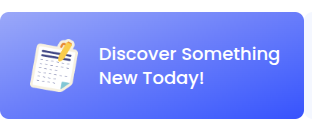
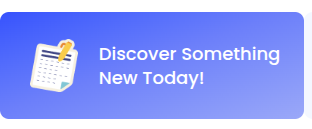

# Project Name: DevBoard

## Project Description:

DevBoard is a Task Manageent website built with HTML, Tailwind CSS, DaisyUI and JavaScript. I created this project to practice JavaScript, DOM manipulation and event handling.

**Key Features:**
- I can see how many task are pending
- See real-time task count.
- random colors backgrund theme toggle.
- if i press the compleet task button: 
  - The task count decreases automatically.
  - A confirmation modal appears.
  - The button is disabled to prevent duplicate actions.
  - The completed task is added to the Active Log section with the current time.
- if all tasks are completed, a congratulations modal show 
- I can view all finished task on te active log section and remove all the notification by just cliking clear history button.

## Live Site Link:

https://web-project-15.netlify.app/

## Project Video:

https://github.com/user-attachments/assets/e10a707c-be90-4b16-8bb0-1056ca7f11e3

## What I Learned New while Building This Project:

1. How to customization tailwind CSS and DaisyUI:  
```css
    <!-- Customize Tailwind CSS -->
    <style type="text/tailwindcss">
        @theme {
      --font-poppins: "Poppins", sans-serif;
    }
  </style>

    <!-- Customize DaisyUI colors -->
    <style>
        :root {
            --color-primary: #3752FD;
            --color-primary-content: #00303C;
            --color-secondary: #F4F7FF;
        }
    </style>
```  
2. If i want this liner gradient using tailwind css,  
   


and if i write the tailwind classes like this, then we got opposite gradient, 
```html
<div
    class="flex gap-5 items-center bg-gradient-to-tl from-[#3752FD] from-0% via-[#6C7FFA] via-53% to-[#9BA8F8] to-100% p-8 rounded-xl">
    <div>
    </div>
    <p class="text-2xl font-medium text-white">Discover Something<br>New Today!</p>
</div>
``` 


but you we reverse the full gradient then we got actual accepted gradient,   
```html
<div
    class="flex gap-5 items-center bg-gradient-to-tl from-[#9BA8F8] from-0% via-[#6C7FFA] via-53% to-[#3752FD] to-100% p-8 rounded-xl">
    <div>
    </div>
    <p class="text-2xl font-medium text-white">Discover Something<br>New Today!</p>
</div>
```
  

3. How to use 12 column grid system properly. 

```html
  <section class="grid grid-cols-12">
    <div class="col-span-3 flex gap-5 items-center bg-secondary p-8 rounded-xl">
        <div class="rounded-full p-4 bg-white">
        </div>
        <div>
            <p class="font-medium">Task Assigned</p>
            <h1 class="font-bold text-3xl">05</h1>
        </div>
    </div>
    <div
        class="col-span-6 mx-6 flex gap-5 items-center bg-gradient-to-tl from-[#9BA8F8] from-0% via-[#6C7FFA] via-53% to-[#3752FD] to-100% p-8 rounded-xl">
        <div>
        </div>
        <p class="text-2xl font-medium text-white">Discover Something<br>New Today!</p>
    </div>
    <div class="col-span-3 flex gap-5 items-center bg-secondary p-8 rounded-xl">
        <div class="rounded-full p-4 bg-white">
        </div>
        <div>
            <p class="font-medium text-xl">Wed,</p>
            <h1 class="font-bold text-xl">Jul 28 2025</h1>
        </div>
    </div>
</section>
```
 

4. How to use line clamp in tailwind css:
```html 
<div class=" bg-white p-4 rounded-lg text-black/50">
    <p class="line-clamp-3">Debug
        using Chrome
        DevTools, check for overlapping elements, and ensure onClick works properly
        and ensure onClick works properly</p>
</div>
```


5. When we use the same script file across multiple HTML pages, we must always check if an ID exists on the current page before accessing it. For example, an ID that exists in index.html might not exist in discover-something-new.html. If we try to access it directly, then we will get error, because js won't find the expected id in that page: 
```js
navigate("navigate-to-discover-something-new-page", "pages/discover-something-new.html")
navigate("navigate-to-home-page", "../index.html")
```
```js
function navigate(id, destination) {
    document.getElementById(id).addEventListener("click", () => {
        window.location.href = destination
    })
}
```

To solve this problem, we can use a condition.so, now the function only attaches the event listener if the element exists on that page, preventing errors when using the same script file across different pages.
```js
function navigate(id, destination) {
    const element = document.getEltementById(id);
    if (element) {
        document.getElementById(id).addEventListener("click", () => {
            window.location.href = destination
        })
    }
}
```

6. How to generate random colors:

Using Hexadecimal Format: 
```js
function getRandomHexColor() {
    const hex = Math.floor(Math.random() * 0xffffff).toString(16); 
    return `#${hex.padStart(6, "0")}`; 
}

console.log(getRandomHexColor()); // Example: "#1a2b3c"
```
- Math.floor(Math.random() * 0xffffff) generates a decimal number between 0 and 16777215 (0xffffff is 16777215 in decimal, which is the maximum hex color value).
- .toString(16) converts it to hexadecimal. Example: 255 → "ff"
- Someting you got less then 6 digts hexadecimal vaues so, .padStart(6, "0") ensures it always has 6 digits. means "fff" → "000fff"

Using RGB Format:
```js
function getRandomRGBColor() {
    const r = Math.floor(Math.random() * 256); // 0 - 255
    const g = Math.floor(Math.random() * 256);
    const b = Math.floor(Math.random() * 256);
    return `rgb(${r}, ${g}, ${b})`;
}

console.log(getRandomRGBColor()); // Example: "rgb(123, 45, 200)"
```
- Math.random() gives a number between 0 and 1.
- Multiply by 256 and use Math.floor() to get an integer between 0–255.

Using RGBA Format: 
```js
function getRandomRGBAColor() {
    const r = Math.floor(Math.random() * 256);
    const g = Math.floor(Math.random() * 256);
    const b = Math.floor(Math.random() * 256);
    const a = Math.random().toFixed(2); // 0.00 - 1.00
    return `rgba(${r}, ${g}, ${b}, ${a})`;
}

console.log(getRandomRGBAColor()); // Example: "rgba(123, 45, 200, 0.53)"

```

7. Different way to get a parent element name when clickeng a button: 

```html
<div class="bg-secondary rounded-2xl p-6">
    <div class="space-y-4">
        <p class="inline-block py-2 px-4 bg-white rounded-lg">Backend</p>
        <h2 class="text-2xl font-medium">API Error Handling</h2>
        <div class="bg-white p-4 rounded-lg text-secondary-content">
            <p class="line-clamp-2">
                Add proper error messages and status codes for failed login attempts, expired tokens,
                and missing resources.
            </p>
        </div>
    </div>
    <hr class="border my-3 border-dashed border-[#3752FD]/20">
    <div class="flex justify-between items-center">
        <div>
            <p class="text-sm text-secondary-content">Deadline</p>
            <p class="font-medium">07 Sept 2025</p>
        </div>
        <div><button class="task-completed-btn btn btn-primary text-white">Completed</button></div>
    </div>
</div>
```

- Using closest() + querySelector()

```js
document.querySelectorAll(".task-completed-btn").forEach(button => {
  button.addEventListener("click", () => {
    const taskName = button
      .closest(".bg-secondary") // find the nearest parent with .bg-secondary
      .querySelector("h2").textContent; // then get its <h2> text

    console.log("Task Completed:", taskName);
  });
});
```
The .closest() method in JavaScript is used to find the nearest ancestor element (including the element itself) that matches a given CSS selector. it Starts from the element itself → then goes upward (parent → grandparent → etc.) uttil gets the first matching element.

- Using parentElement chaining:

```js
document.querySelectorAll(".task-completed-btn").forEach(button => {
  button.addEventListener("click", () => {
    // Go up to parent, then search inside
    const taskName = button.parentElement.parentElement.parentElement.querySelector("h2").textContent;
    console.log("Task Completed:", taskName);
  });
});
```

- Using Event Delegation
Instead of attaching listeners to every button, attach one listener to the parent container:

```js
document.body.addEventListener("click", (e) => {
  if (e.target.classList.contains("task-completed-btn")) {
    const taskName = e.target.closest(".bg-secondary").querySelector("h2").textContent;
    console.log("Task Completed:", taskName);
  }
});
```

## Challenges I faced while Building This Project:

1. In this prject i just faced little bit chalanges while bulind logic for the task section. 

```js
const buttons = document.getElementsByClassName("task-completed-btn");
const taskNumber = document.getElementById("task-number").innerText;
let integerTaskNumber = parseInt(taskNumber);

let num = integerTaskNumber;

for (let button of buttons) {
    button.addEventListener("click", () => {

        // when click task number will be reduce
        num--;
        document.getElementById("task-number").innerText = num;

        // when reduce a alert show
        alert("Board Update Successfully!")

        // after reducing button will be disabled
        button.setAttribute("disabled", "disabled")

        // show task info to the sidebar active log section
        const taskName = button.parentElement.parentElement.parentElement.querySelector("h2").innerText;

        const container = document.getElementById("completed-task-container");
        const p = document.createElement("p");
        p.classList.add("bg-secondary", "rounded-lg", "p-2.5");
        const time = getDateOrTime()
        p.innerText = `You have completed the task ${taskName} at ${time}`
        container.appendChild(p)

        // if all task donw show a alert
        if (num === 0) {
            alert("congratulation! you completed all the current task")
            return;
        }
    })
}

// if clicked clear history button all history will be removed
document.getElementById("clear-history-btn").addEventListener("click", () => {
    document.getElementById("completed-task-container").innerText = ""
})
```

## Contact With Me: 

contact2tamim@gmail.com | https://www.linkedin.com/in/tamim-muhammad/

---

Thank you so much for checking out my project! If you have any suggestions or feedback, feel free to share them.

